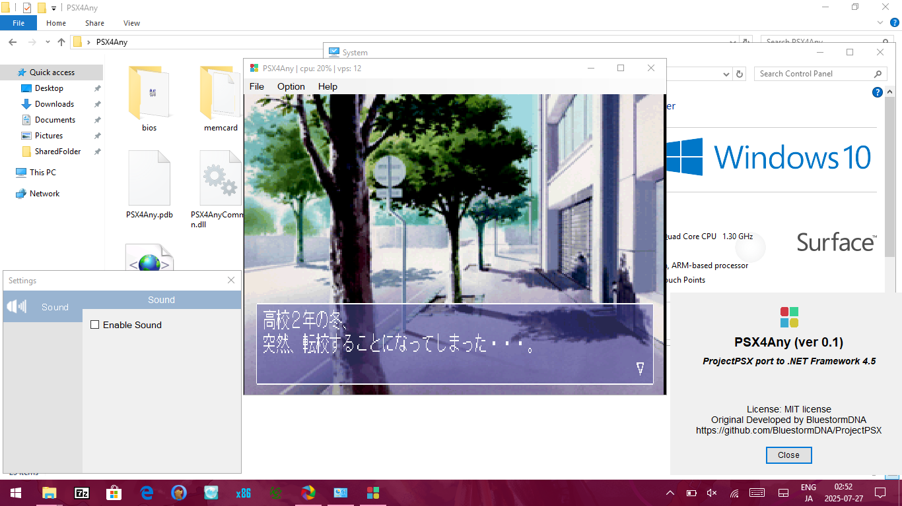

# PSX4Any
Play Station 1 Emulator for .NET Framework 4.5 Any CPU

  

# Attention
PSX4Any is still in beta, so games a works not full speed.

# Note
bios: scph1001.bin to bios folder

memcard: "memcard.mcr" created automatically when save game

.NET Framework 4.5

# Tested
Surface RT (Windows 10 ARM32) (maybe works on windows RT 8/8.1)

# Controls
D-Pad UP: Up

D-Pad Left: Left

D-Pad Down: Down

D-Pad Right: Right

Triangle: W

Square: A

X: S

Circle: D

Start: Enter

Select: Space

L1: Q

R1: E

L2: 1

R2: 3

# Todo List
✖JIT Compiler

✖GPU Acceleration

✖Frame Limit

✖Frame Skip

✖Screen controller

✖Change Resolution Support

✖Full Screen Support

✖Fast ROM Load

# License
MIT License

# Credit
This project would not have been possible without all of the following great developers!

[ProjectPSX](https://github.com/BluestormDNA/ProjectPSX) >> PSX4Any is develop based on this.

[NAudio](https://github.com/naudio/NAudio) >> used this for audio backend.
